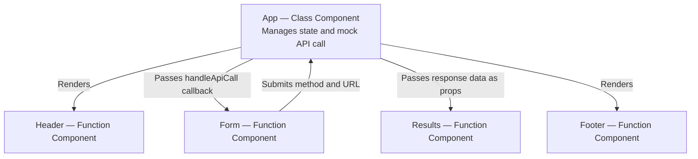

# RESTy — Lab 26 UML Diagram

```mermaid
flowchart TD
    A["App — Class Component<br/>Manages state and mock API call"]
    H["Header — Function Component"]
    F["Form — Function Component"]
    R["Results — Function Component"]
    FT["Footer — Function Component"]

    A -->|Renders| H
    A -->|Passes handleApiCall callback| F
    F -->|Submits method and URL| A
    A -->|Passes response data as props| R
    A -->|Renders| FT
```