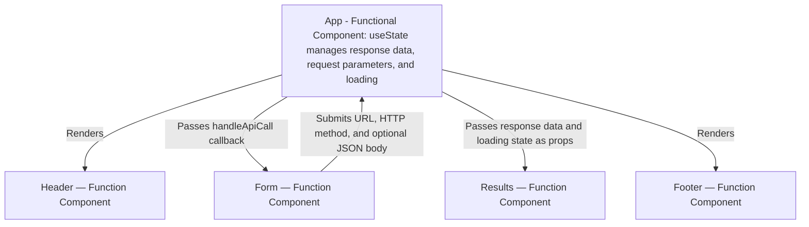

# RESTy — Lab 27 UML Diagram

```mermaid
flowchart TD
    A["App - Functional Component: useState manages response data, request parameters, and loading"]
    H["Header — Function Component"]
    F["Form — Function Component"]
    R["Results — Function Component"]
    FT["Footer — Function Component"]

    A -->|Renders| H
    A -->|Passes handleApiCall callback| F
    F -->|Submits URL, HTTP method, and optional JSON body| A
    A -->|Passes response data and loading state as props| R
    A -->|Renders| FT
```